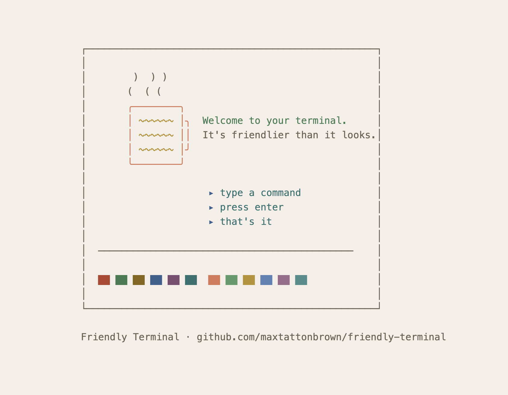

# Claude Code: Easy Mode

The nicest, simplest way to get started with [Claude Code](https://docs.anthropic.com/en/docs/claude-code).



## Install

1. [Sign up for Claude](https://claude.ai/referral/hWvMMltr7Q) if you haven't already. This link gives you a free week of Claude Code.
2. Open your terminal (on Mac, search for "Terminal" in Spotlight or find it in Applications/Utilities/)
3. Paste this and press Enter:

```bash
curl -fsSL https://raw.githubusercontent.com/maxtattonbrown/claude-code-easy-mode/main/install.sh | bash
```

That's it. One command. It installs Claude Code if you don't have it, then sets up Easy Mode. Nothing you can't undo.

## What it does

**1. A warm, friendly theme** — replaces the black void with a parchment background, soft text, and coral accents, just like Claude Desktop.

**2. Welcome skill** — type `/welcome` in Claude Code for a friendly introduction. Three things to try, no jargon.

**3. Beginner-friendly instructions** — tells Claude to explain what it's doing, use simple language, and suggest next steps. Automatically applied to every session.

**4. Helpful status bar** — a little assistant that makes suggestions around context and things to try.

```
🟢 Try: "make me a website about dogs" · my-folder
🟡 Context filling up — type /compact · my-folder
🔴 Running low on context — type /compact now · my-folder
```

When everything's fine, it shows tips and suggestions. When your conversation is getting long, it tells you exactly what to do.

**5. Useful plugins** — enables a handful of the best Claude plugins, including frontend design (build web pages), document skills (PDFs, docs, spreadsheets), and explanatory mode (Claude narrates its thinking).

## What's the status bar telling me?

When you chat with Claude Code, it keeps track of everything you've said in the conversation. This is called "context." The longer you talk, the more context builds up — and eventually Claude starts to forget the earlier parts.

The status bar watches this for you:

- **🟢 Green** — you're fine. You'll see a rotating tip or suggestion.
- **🟡 Yellow** — conversation is getting long. Type `/compact` to let Claude summarise and free up space.
- **🔴 Red** — you really need to type `/compact` now, or start a new conversation.

## Uninstall

To remove everything and restore your original settings, paste this:

<details>
<summary>Show uninstall command</summary>

```bash
curl -fsSL https://raw.githubusercontent.com/maxtattonbrown/claude-code-easy-mode/main/install.sh | bash -s -- --uninstall
```

</details>

Nothing permanent — your original settings are backed up and restored.

## Credits

Made by [Max Tatton-Brown](https://github.com/maxtattonbrown). The colour theme is [Friendly Terminal](https://github.com/maxtattonbrown/friendly-terminal).
